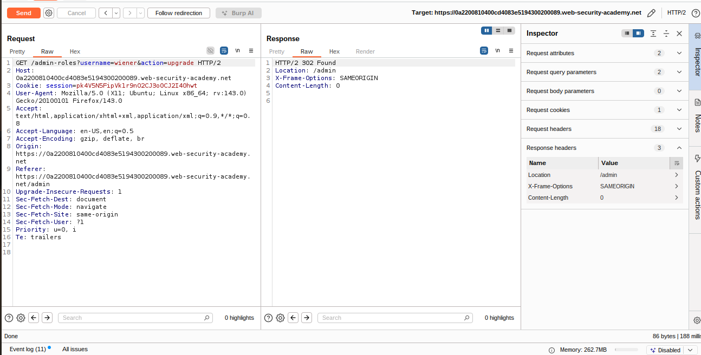

# Lab: Method-based access control can be circumvented
### Objective 
* The vulnerability here is that the server decide who is authorized to make changes according to the http method if it is `GET` you can make changes .
---
### solution 
* change the method from `POST` to `GET` in admin request and make your changes on the admin request.
#### Steps 
1. login as admin using admin credentials `administrator:admin`
1. Open burpsuite & interception
1. upgrade `Carlos` Role 
    * send this request to repeater
    * 
1. login as a user using using the credentials `wiener:peter`
    * send this request to repeater
    * copy session cookies
    * 
1. go to the upgrade role request that you have send to repeater before in step 3 
    * Right click and select "Change request method" -> `GET`. 
    * change username to `wiener`
    * past `wiener` session cookies 
    * 

## Note
* why solution told us to try `POSTX`
    * We try using POSTX (an invalid HTTP method) to test how the server handles unexpected methods.
    * Normally, the server should respond with “405 Method Not Allowed” if it strictly validates allowed HTTP methods.
    * However, if the response changes to something like “missing parameter”, it indicates that the server accepts or partially processes requests with unknown methods, meaning the access control might depend on the HTTP method — a sign of a potential method-based access control flaw.

## References 
* [Lab-Link](https://portswigger.net/web-security/access-control/lab-method-based-access-control-can-be-circumvented)